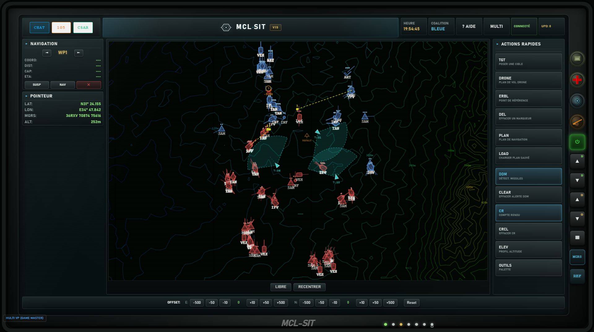

# MCL-SIT

Système d'information tactique pour **DCS World**, conçu pour les équipages au sol et les opérations interarmes.

---

** DISCORD 131st DEATH VIPERS ** : Notre escadrille se fonde avant tout sur l'innovation et la recherche en matière de développement, au travers du modding (FRENCHPACK, DAMPACK), du scripting ou de ce type d'applications. Nous recrutons sur tout hélicoptère, pas mal d'avions et évidemment en commandement grâce à ce type d'outil. 

## C'est quoi ?

MCL-SIT est une **tablette tactique** qui tourne en parallèle de DCS et donne à l'équipage une vision claire de la situation : positions amies et ennemies, plans de feu, gestion de l'EVASAN, communication entre joueurs, le tout sur une carte topographique avec grille MGRS.

L'idée : sortir le commandement de la tête du chef de char et lui donner un vrai outil pour planifier, coordonner et rendre compte. Il permet également à plus large mesure à tout utilisateur en disposant, même sans DCS, de gérer et commander un champ de bataille. 

## Ce que ça permet

- **Situation tactique partagée** entre tous les véhicules connectés (joueurs et IA)
- **Plans de feu artillerie** (JFO) avec sélection de la pièce, type de tir, ajustement
- **Spawn de groupes** en cours de mission : peloton 105, CSAR, ravitaillement
- **EVASAN** : demande, prise en charge, suivi des blessés
- **Profil d'élévation** entre deux points (visée masquée, ligne de vue)
- **DDM** — détection missile partagée à toute la coalition
- **Drone** : plan de vol partagé, retasking en clic droit
- **Chat tactique** (texte + messages prédéfinis)
- **PCDB** — notes partagées géolocalisées sur la carte
- **Coordination CSAR** avec recherche de pilote éjecté

## Comment ça marche

- Un **serveur SIT** tourne sur la machine DCS (ou un PC dédié)
- Chaque joueur lance MCL-SIT en mode **Client** et se connecte au serveur
- Un **hook Lua** côté DCS fait remonter la position des véhicules, les ennemis détectés, les événements de mission
- Tout est synchronisé en temps réel via WebSocket

Pour les sessions solo : un mode **Client + Serveur** permet de tout faire tourner sur le même PC. (Encore en travail)

## Installation

Téléchargez simplement la dernière release et lancez l'installeur. Le SIT se mettra automatiquement à jour en cas de maj côté github. (Miracle de la technologie moderne...)

---

*Développé par 131st-Dimitriov pour la 131st Death Vipers.*
